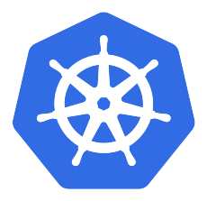
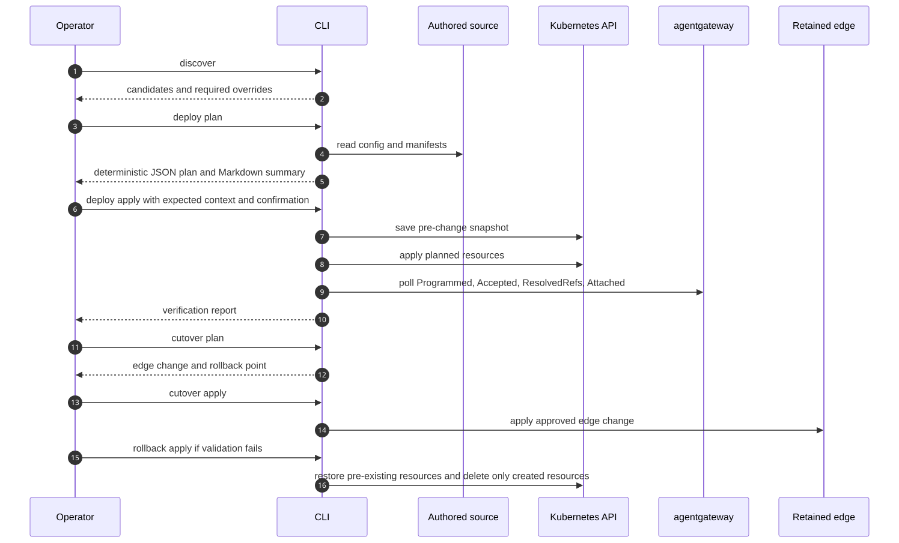

# Air-Gapped AI Gateway Platform

|  |  |  |  |  |  |  |  |
| --- | --- | --- | --- | --- | --- | --- | --- |
| Kubernetes | agentgateway | Envoy | NVIDIA NIM | Redis | NGINX | Python | GitHub Actions |

A reference implementation of a governed internal AI API platform for Kubernetes
clusters that have no internet access. It places a policy-enforcing gateway in
front of self-hosted inference services, gives every calling application its own
identity and model entitlements, and delivers the whole stack through an offline
supply chain with reviewable, reversible change control.

---

## Contents

1. [Problem statement](#1-problem-statement)
2. [Solution overview](#2-solution-overview)
3. [Architecture](#3-architecture)
4. [Supported baseline](#4-supported-baseline)
5. [Operational sequence](#5-operational-sequence)
6. [Deployment steps](#6-deployment-steps)
7. [Verification](#7-verification)
8. [Platform operations](#8-platform-operations)
9. [Repository layout](#9-repository-layout)
10. [Development workflow](#10-development-workflow)
11. [Security](#11-security)
12. [Architecture decisions](#12-architecture-decisions)
13. [References](#13-references)

---

## 1. Problem statement

### 1.1 Operating context

An air-gapped environment is a network with no route to the public internet.
Regulated sectors such as banking, government, defence, and healthcare run this
way by policy: every container image, Helm chart, Custom Resource Definition
(CRD), and software dependency must be reviewed and imported deliberately before
a workload can use it.

Organisations in these sectors increasingly self-host large language models
rather than call an external API, because prompts and responses cannot leave the
network. NVIDIA NIM is one common way to do this — it packages a model behind an
OpenAI-compatible HTTP interface, so applications call familiar endpoints such as
`/v1/chat/completions` and `/v1/embeddings` against a service running inside the
cluster.

### 1.2 What breaks at scale

A single model serving a single application needs no platform layer. A Kubernetes
Service and an Ingress are sufficient. The architecture stops holding once the
environment contains several models and several consuming applications, because
the following questions have no owner:

| Question | Consequence when unanswered |
| --- | --- |
| Which application issued this request? | No attribution, no usage accounting, no audit trail |
| Which models may that application call? | Any workload with network reach can call any model |
| How is access revoked for one application? | Revocation requires changing the model deployment itself |
| What limits one consumer's throughput? | A single caller can exhaust GPU capacity for everyone |
| Which route, policy, and backend served the request? | Incidents are debugged by inspecting several layers at once |
| How does any of this get installed offline? | Installation depends on registries the cluster cannot reach |

Answering these inside each model deployment does not scale. Every new model
would reimplement authentication, entitlement, quota, and telemetry, and each
implementation would drift from the others.

### 1.3 Derived requirements

The platform therefore has to provide:

- **Identity** — a stable, per-workload credential resolved to a named consumer.
- **Authorization** — per-model entitlement, denied by default.
- **Quota** — throughput limits attributed to the consumer, not the source IP.
- **Observability** — consistent identity across policy decisions and metrics.
- **Offline delivery** — every dependency resolved, verified, and imported before
  installation begins.
- **Controlled change** — planned, gated, verifiable, and reversible operations
  against production traffic.

---

## 2. Solution overview

### 2.1 What the platform delivers

The solution introduces one gateway as the single entry point for internal model
traffic. Applications no longer address model services directly. They present a
credential to the gateway, which resolves it to a consumer identity, checks that
consumer's entitlement for the requested model, applies the relevant rate limit,
records telemetry, and only then forwards the request to the model service.

Around that runtime behaviour, the repository provides the delivery and
operational machinery: declarative manifests as the source of truth, an offline
dependency bundle with checksum verification, a command-line tool that plans
changes before applying them, a disposable test cluster that proves policy
behaviour, and rollback driven by recorded resource ownership.

### 2.2 Design principles

| Principle | Rationale |
| --- | --- |
| One gateway, one route per model | Keeps the relationship between a model and its policy direct and auditable |
| Default deny on model onboarding | Adding a model never widens an existing consumer's access |
| Application identity, not human identity | The gateway authenticates workloads; user sessions remain the application's concern |
| Separate installation from cutover | The gateway is proven internally before production traffic moves |
| Declarative source of truth | Runtime objects are inspected for health; durable change happens in authored inputs |
| Ownership-aware rollback | Recovery removes only what a run created and never the model workloads |
| Pinned, tested version sets | Support is defined by passing tests, not by a compatibility claim in prose |

---

## 3. Architecture

### 3.1 Component inventory

The platform composes upstream projects rather than replacing them. Each
component owns one concern:

| Component | Role in the solution |
| --- | --- |
| **Kubernetes Gateway API** | The routing contract. Successor to Ingress, splitting responsibilities across `GatewayClass` (which controller implements it), `Gateway` (the listener), and `HTTPRoute` (host and path rules) |
| **agentgateway** | The AI policy layer. Adds custom resources for consumer authentication, per-model authorization, AI backend behaviour, rate-limit policy, and telemetry attributes |
| **Envoy** | The proxy technology underneath the gateway data plane that carries model traffic |
| **NVIDIA NIM** | The model runtime. Serves OpenAI-compatible chat and embedding APIs; owned by the model platform, not by this gateway |
| **Envoy ratelimit + Redis** | The quota service and its counter store, evaluating rate-limit descriptors emitted by gateway policy |
| **NGINX** | Optional retained edge. Where one already terminates public DNS and TLS, it is kept and repointed rather than replaced |
| **Kustomize manifests** | The declarative source of truth, organised as bases plus environment overlays |
| **Python CLI** | Discovery, rendering, planning, gated apply, verification, rollback, and offline bundle handling |
| **kind lab** | A disposable local cluster that proves policy behaviour with mock model services |

### 3.2 Request path

Before the gateway is introduced, applications reach model services directly or
through whatever edge already exists. Afterwards, applications keep one stable
entry point and the platform enforces identity, routing, entitlement, quota, and
telemetry in a single place. The model service returns to serving inference only.


The same transition, as a maintained diagram source:



Two exposure patterns are supported, and the choice does not change the internal
design:

| Pattern | External entry point | When it applies |
| --- | --- | --- |
| Retained edge | Existing NGINX keeps DNS, TLS, and public routing; forwards to the internal gateway Service | Brownfield environments with a working production edge |
| Direct exposure | The gateway data plane is published through an approved load balancer or ingress path | Greenfield environments, once DNS, TLS, firewall, and rollback ownership are designed |

Both converge on the same internal contract: Gateway API owns listener and route
behaviour, agentgateway owns AI policy, the controller reconciles declared state,
the data plane serves requests, and model services stay focused on inference.

Reference: [docs/architecture.md](docs/architecture.md).

### 3.3 Control plane and data plane

agentgateway runs as two distinct workloads, and separating them is essential for
diagnosis. The **controller** watches Kubernetes resources and reconciles desired
state; it does not carry model traffic. The **data plane** is the proxy the
controller generates from a `Gateway` resource, and it is what actually serves
requests.




The distinction determines where an investigation starts:

| Symptom | Layer to investigate first |
| --- | --- |
| `Gateway` never reaches `Programmed=True` | CRDs, controller readiness, `GatewayClass`, parameters, reconciliation |
| `Gateway` is programmed but requests fail | Host matching, route attachment, policy attachment, rate-limit state, backend resolution, model health |

Because the data plane is generated, it is treated as output. Editing the
generated Deployment directly creates drift that reconciliation may overwrite;
durable changes belong in the authored manifests and configuration.

### 3.4 Chat and embedding backends

Chat completions and embeddings are both OpenAI-compatible, but they are not
interchangeable request shapes. A chat request carries a `messages[]` array; an
embedding request carries `input`. In the tested baseline they therefore use
different backend representations:


| API | Backend representation |
| --- | --- |
| `/v1/chat/completions` | `AgentgatewayBackend` configured as an OpenAI-compatible AI provider |
| `/v1/embeddings` | Kubernetes Service backend, routed through the gateway |

The embedding route still receives authentication, authorization, rate limiting,
and telemetry. Only the final backend representation differs. This is
version-specific behaviour and is retested on upgrade.

Reference: [ADR 0002](docs/adr/0002-chat-vs-embedding-backends.md).

### 3.5 Policy model

Every request passes through four controls before it reaches a model. Each
control resolves one question, and each rejects with a distinct status code, so
a failed request identifies the control that rejected it without further
correlation. The controls are evaluated in the order below: routing selects the
model route first, and policy is applied only once a route is matched.

| Order | Control | Question resolved | Rejection signal |
| --- | --- | --- | --- |
| 1 | Routing | Does the host and path match a published model route? | `404` |
| 2 | Authentication | Is the presented credential known to the platform? | `401` |
| 3 | Authorization | Is that consumer entitled to this specific model? | `403` |
| 4 | Rate limiting | Is the consumer within its quota for this descriptor? | `429` |



The identity that these controls operate on is the **consumer**: the platform
identity of an application or workload, not of a person. A consumer record
carries a stable key, an allowed model list, and a rate-limit tier. The same
`consumer_id` is used for the authorization decision, the quota descriptor, and
the emitted metrics, which is what makes a single request traceable across all
three without correlating identifiers between systems.

Human authentication remains the responsibility of the calling application. A
browser authenticates to an application backend, and that backend holds the
gateway credential on the user's behalf.

Reference: [docs/security-model.md](docs/security-model.md).

---

## 4. Supported baseline

Support in this repository means a version set whose behaviour is proven by
manifests, configuration, and passing tests — not a compatibility claim in
documentation. The delivered baseline is:

| Component | Version | Status |
| --- | --- | --- |
| agentgateway | v1.3.1 | Delivered baseline |
| Gateway API | v1.5.0 experimental | Delivered baseline |
| agentgateway | v1.4.0 | Validation target, not supported |

agentgateway v1.4.0 advertises security-relevant behaviour, notably API keys
stored as SHA-256 hashes rather than raw values. That is a desirable improvement,
so it is tracked deliberately rather than adopted silently. It becomes the
baseline once tests prove hashed-key authentication on the intended routes,
continued metadata propagation into authorization and quota and telemetry, clean
handling of the Gateway API version change, reliable rollback, and documentation
that no longer implies raw-key storage.

Run the baseline checks from source:

```bash
make test
make validate
airgap-ai-gateway --config examples/config verify \
  --lock-file airgap/sources.lock.yaml \
  --compatibility-set baseline-v1.3.1 \
  --registry registry.example.internal:5000
```

The full matrix — delivered version, supported API, status, evidence, and upgrade
risk for every component — is in [docs/compatibility.md](docs/compatibility.md).

---

## 5. Operational sequence

The platform is operated as an ordered sequence rather than a set of manifests
applied at once. The same sequence is used by the local lab and by an
environment-specific rollout. Read-only and offline stages carry no risk to the
cluster; mutating stages are gated; rollback is a first-class stage rather than
an improvised recovery.



| Stage | Purpose | Cluster impact |
| --- | --- | --- |
| 1. Discover | Read the current model, route, and edge state | None — read-only |
| 2. Plan | Render the overlay and produce a reviewable plan | None — offline |
| 3. Apply | Execute only the approved plan, after snapshotting | Installs the gateway; production traffic unchanged |
| 4. Verify | Prove conditions and the request matrix internally | None — reads and test requests |
| 5. Cut over | Repoint the edge to the gateway Service | Changes the production request path |
| 6. Roll back | Restore the previous path, then remove owned resources | Recovery only |

The separation between stages 3 and 5 is the central operational decision. If the
gateway fails its internal tests, production traffic never moves. If the cutover
fails after those tests passed, the fault is isolated to the edge layer, and the
first recovery action is to restore the previous edge backend rather than to
uninstall the gateway.

---

## 6. Deployment steps

### 6.1 Local proof path

The fastest way to evaluate the solution is the disposable local lab, which
requires no GPUs, no model weights, and no NVIDIA images:

```bash
python -m pip install -c constraints.txt -r requirements-dev.txt -e .
make airgap-demo
make render
make validate
make kind-test
```

This builds and verifies an offline bundle, renders the manifests, validates
them, then creates a temporary kind cluster with mock OpenAI-compatible model
services and runs the full policy matrix against it.

### 6.2 Prepare the offline bundle

In a disconnected environment, dependency resolution happens before installation
rather than during it. The dependency set covers Gateway API CRDs, agentgateway
CRD and controller charts, controller and data-plane images, Redis, the Envoy
ratelimit image, Python wheels, and required tooling.


Every entry is pinned in [airgap/sources.lock.yaml](airgap/sources.lock.yaml)
with its version, canonical source, destination name, checksum or OCI digest,
provenance note, license note, and compatibility-set membership.

The workflow is two-sided: the bundle is assembled and checked on the connected
side, then verified with no network access on the disconnected side, promoted
into an internal registry, and matched against the rendered manifests.



```bash
airgap-ai-gateway bundle build \
  --lock-file airgap/sources.lock.yaml \
  --compatibility-set baseline-v1.3.1 \
  --registry registry.example.internal:5000 \
  --dist-dir dist/airgap-demo

airgap-ai-gateway bundle verify \
  --lock-file airgap/sources.lock.yaml \
  --compatibility-set baseline-v1.3.1 \
  --registry registry.example.internal:5000 \
  --bundle-dir dist/airgap-demo/baseline-v1.3.1

airgap-ai-gateway --config examples/config registry promote \
  --lock-file airgap/sources.lock.yaml \
  --compatibility-set baseline-v1.3.1 \
  --registry registry.example.internal:5000 \
  --output-file dist/airgap-demo/promotion-plan.json
```

Images are promoted to an internal registry reachable by every cluster node.
Loading images onto individual nodes is not a supported strategy, because the
first reschedule onto another node will fail to pull.

Reference: [docs/airgap-bundle.md](docs/airgap-bundle.md).

### 6.3 Render and validate the manifests

The Kubernetes source of truth is a Kustomize tree under
[manifests/baseline-v1.3.1](manifests/baseline-v1.3.1): bases describe the
platform objects, and overlays describe environment shape.

```bash
make render
make validate
python scripts/validate_manifests.py
```

| Overlay | Purpose |
| --- | --- |
| `kind-demo` | Small static demo render, single replica |
| `kind-e2e-lab` | Disposable behavioural proof with mock model Services |
| `retained-nginx-edge` | Brownfield migration keeping the existing edge |
| `production-reference` | Production-oriented shape with explicit HA and persistence decisions |

Validation rejects public registry references, mutable production tags,
unprotected routes, ambiguous Service ports, missing route policies,
cross-namespace references without explicit trust, and rendered Secret data. The
production reference does not represent a single Redis Pod as highly available;
it points to an external HA Redis contract instead.

Reference: [manifests/README.md](manifests/README.md).

### 6.4 Discover the target environment

Discovery is read-only. It reports the observed model services, routes, and edge
state, and identifies any ambiguity an operator must resolve explicitly rather
than letting automation choose.

```bash
airgap-ai-gateway --config examples/config discover
```

### 6.5 Plan the change

Planning is offline and produces two artefacts for review: `plan.json` as the
deterministic contract the executor follows, and `plan.md` as the human summary.

```bash
airgap-ai-gateway --config examples/config deploy plan \
  --overlay retained-nginx-edge \
  --apply-mode server-side-dry-run \
  --output-dir runs/plans/deploy
```

If the plan does not describe the intended change, the correction belongs in the
source, not in a manual adjustment after applying.

### 6.6 Apply the approved plan

Every state-changing operation requires the exact expected cluster context, an
apply mode matching the reviewed plan, a confirmation token, the approved plan
file, and a saved pre-change snapshot. A context mismatch fails closed.

```bash
airgap-ai-gateway --config examples/config deploy apply \
  --expected-context kind-airgap-ai-gateway \
  --apply-mode server-side-dry-run \
  --confirm I_UNDERSTAND_DISPOSABLE_CONTEXT_ONLY \
  --plan-file runs/plans/deploy/plan.json \
  --snapshot-file runs/snapshots/pre-change.json \
  --commands-log runs/reports/deploy/commands.log
```

Reference: [docs/deployment.md](docs/deployment.md).

### 6.7 Verify the internal path

The gateway is tested through its internal Service before any production traffic
is involved, which removes DNS, TLS, external load balancers, and legacy ingress
behaviour from the diagnosis.


### 6.8 Cut over the edge

Cutover is planned and applied as a separate operation. With a retained edge,
DNS and TLS do not move; only the edge backend changes.


```bash
airgap-ai-gateway --config examples/config cutover plan \
  --overlay retained-nginx-edge \
  --apply-mode server-side-dry-run \
  --output-dir runs/plans/cutover

airgap-ai-gateway --config examples/config cutover apply \
  --expected-context kind-airgap-ai-gateway \
  --apply-mode server-side-dry-run \
  --confirm I_UNDERSTAND_DISPOSABLE_CONTEXT_ONLY \
  --plan-file runs/plans/cutover/plan.json \
  --snapshot-file runs/snapshots/pre-cutover.json \
  --commands-log runs/reports/cutover/commands.log
```

Reference: [ADR 0003](docs/adr/0003-staged-cutover-and-rollback.md).

---

## 7. Verification

### 7.1 Why failures are part of the proof

A gateway is a policy boundary, so readiness probes and successful requests are
insufficient evidence. The platform must demonstrate that unauthorised requests
fail for the correct reason as reliably as it demonstrates that authorised
requests succeed.


| Request | Expected signal | What it proves |
| --- | --- | --- |
| No API key | 401 | Anonymous access is closed |
| Unknown API key | 401 | Only known runtime credentials are accepted |
| Qwen consumer with Qwen grant | 200 | Chat route, backend, and policy align |
| Valid consumer without Qwen grant | 403 | Entitlement is route-specific |
| Gemma consumer with Gemma grant | 200 | The second chat route is independent |
| Embedding consumer with embedding grant | 200 with vector length greater than zero | The embedding response shape is validated |
| Valid consumer without embedding grant | 403 | Embedding access is not granted broadly |
| Low-limit consumer under repeated traffic | 429 | Descriptor and counter path are active |
| Wrong Host header | 404 | Host and route matching bound the surface |
| Broken backend route | Diagnostic condition or expected upstream failure | Backend errors remain visible |
| Gateway cleanup | Model Services remain present | Gateway lifecycle is separate from model lifecycle |

The embedding assertion checks vector length rather than status code alone, so a
`200` proves an actual embedding response instead of any successful HTTP reply.

### 7.2 Resource conditions

Runtime verification also polls bounded Kubernetes conditions, because a resource
existing is not the same as a resource working:

- `Gateway` — `Programmed=True`
- `HTTPRoute` — `Accepted=True` and `ResolvedRefs=True`
- `AgentgatewayPolicy` — `Accepted=True` and `Attached=True`
- `Deployment` — observed generation and available replicas match the request

### 7.3 Running the proof

```bash
make lint
make test
make validate
make kind-test
```

The lab creates a uniquely named cluster and registry, tears down only what it
created, and writes JUnit, JSON, and Markdown evidence.

References: [docs/verification.md](docs/verification.md),
[docs/kind-e2e-lab.md](docs/kind-e2e-lab.md).

---

## 8. Platform operations

### 8.1 Onboarding a model

Adding a model is a routine platform operation rather than a bespoke migration.
Each model is identified by a stable model key, which propagates to the route
name, backend name, policy name, permission field, labels, tests, and report
fields.


Onboarding is default-deny. Publishing a model route grants no access to any
existing consumer; entitlement is added afterwards, to one named consumer at a
time. The procedure is therefore structured as six phases separated by two
verification gates, and a failed gate stops the onboarding rather than
downgrading it to a warning. The first gate proves that the route is genuinely
closed before any entitlement exists; the second proves that the entitlement
granted reaches exactly one consumer and no others.



| Phase | Action | Exit condition |
| --- | --- | --- |
| 1. Define the contract | Assign the model key; declare backend Service, port, and API shape; confirm the model Service responds directly | Model answers on its own endpoint |
| 2. Publish under policy | Create the `HTTPRoute` and attach its route policy with no grants | Route exists and the policy reports `Attached=True` |
| 3. Prove default deny | Issue requests as existing consumers | **Gate:** every existing consumer receives `403` |
| 4. Grant entitlement | Add the model to one selected consumer; add its rate-limit entries | Consumer record and quota descriptor updated |
| 5. Prove entitlement scope | Re-issue requests as the granted consumer and as unrelated consumers | **Gate:** granted consumer receives `200`, unrelated consumers still `403` |
| 6. Release | Commit the `401`, `403`, `200`, and `429` assertions; promote through the bundle and deployment workflow | Behaviour is enforced by the test suite |

A failure at either gate indicates that the policy is not attached to the
intended route, or that entitlement was applied more broadly than intended.
Neither condition should be resolved by granting access more widely.

```bash
airgap-ai-gateway --config examples/config model add --model-key qwen-chat
```

Reference: [docs/model-onboarding.md](docs/model-onboarding.md).

### 8.2 Consumer lifecycle

A consumer record represents one calling workload. Its credential value is never
repository content; it is held in the environment's runtime secret system, and
the repository defines only the Secret names, labels, and metadata schema.


Rotation is performed with overlap so no application outage occurs: add a second
credential for the same consumer identity, move the application to it, confirm
that traffic and metrics still report the same `consumer_id`, then remove the
old credential.


Disable and revoke are separate operations with different purposes. Disabling
retains the identity record and removes model access, preserving audit
continuity. Revoking invalidates the credential material and is required when a
key is exposed or suspected of exposure.

Removing a route policy is never the correct way to remove one consumer's access,
because it would affect every consumer of that model and leave the route
unprotected in the interim. The consumer's entitlement is changed instead.

```bash
airgap-ai-gateway --config examples/config consumer add --consumer-key search-app
airgap-ai-gateway --config examples/config consumer rotate --consumer-key search-app
airgap-ai-gateway --config examples/config consumer revoke --consumer-key search-app
```

Reference: [docs/consumer-lifecycle.md](docs/consumer-lifecycle.md).

### 8.3 Troubleshooting

Because each control fails with a distinct signal, the response code identifies
the responsible layer before any manifest is opened.

| Response | Most likely cause | Where to investigate |
| --- | --- | --- |
| `200` | Request passed policy and the model responded | No action required |
| `400` | Request body does not match the model API | Client payload shape against the model's expected schema |
| `401` | Missing, invalid, or revoked key | Header format, runtime Secret, credential reference |
| `403` | Valid consumer, model permission denied | Consumer permission field, policy target, default-deny state |
| `404` | Host or path did not match a route | Host header, listener hostname, route hostname and path, edge Host preservation |
| `405` | Wrong HTTP method or endpoint | Route path and method match against the published model API |
| `429` | Consumer rate limit enforced | Descriptor metadata, ratelimit service health, Redis reachability |
| `500` / `502` / `503` | Gateway, Service, or model backend fault | Data-plane health, backend Service endpoints, model readiness |
| Timeout | Network path, or a slow or unhealthy model | NetworkPolicies, model resource pressure, upstream timeouts |

Kubernetes conditions narrow the remaining cases. `ResolvedRefs=False` means a
route cannot resolve its backend reference, and no credential change will help
until it does. `Attached=False` means a policy did not bind to its target, which
a typo in `targetRef` will produce as a valid object protecting nothing.
`Programmed=False` points at the controller or the generated data plane.



Reference: [docs/troubleshooting.md](docs/troubleshooting.md).

### 8.4 Rollback and decommission

Rollback is driven by a state ledger that records, for every resource, whether it
was created by the run, updated by the run, or already present beforehand. That
record is what prevents recovery from deleting resources the gateway operation
never owned — most importantly the model workloads themselves.


1. Restore the previous edge or exposure path.
2. Confirm client traffic reaches the previous backend.
3. Retain the gateway installation if it assists diagnosis.
4. Restore updated resources from the snapshot.
5. Delete only resources recorded as created by the selected run.
6. Remove gateway resources once traffic no longer depends on them.

The cleanup guard fails closed when edge or ingress state cannot be read: absent
proof that traffic no longer depends on the gateway, no gateway resources are
removed.

```bash
airgap-ai-gateway --config examples/config rollback plan \
  --ledger-file runs/reports/deploy/ledger.json \
  --run-id run-1 \
  --apply-mode server-side-dry-run \
  --output-dir runs/plans/rollback

airgap-ai-gateway --config examples/config rollback apply \
  --expected-context kind-airgap-ai-gateway \
  --apply-mode server-side-dry-run \
  --confirm I_UNDERSTAND_DISPOSABLE_CONTEXT_ONLY \
  --plan-file runs/plans/rollback/plan.json \
  --snapshot-file runs/snapshots/pre-change.json \
  --ledger-file runs/reports/deploy/ledger.json \
  --commands-log runs/reports/rollback/commands.log
```

Reference: [docs/rollback.md](docs/rollback.md).

---

## 9. Repository layout

```text
.
├── airgap/                         # Source lock and example bundle reports
├── docs/                           # Architecture, security, runbooks, ADRs, and assets
├── examples/config/                # Example platform, model, consumer, and registry config
├── lab/                            # Mock OpenAI-compatible services and E2E fixtures
├── manifests/baseline-v1.3.1/      # Kustomize source of truth for the tested baseline
├── scripts/                        # Validation, lab, asset, and link-check scripts
├── src/airgap_ai_gateway/          # Typed CLI, planner, executor, verifier, bundle logic
└── tests/                          # Unit, regression, manifest, and lab safety tests
```

Source, tests, documentation, schemas, and example reports are tracked. Runtime
credentials, kubeconfig material, generated run directories, OCI archives, chart
archives, wheelhouses, and offline bundle payloads are not.

---

## 10. Development workflow

```bash
python -m pip install -c constraints.txt -r requirements-dev.txt -e .
```

Inspect the CLI:

```bash
airgap-ai-gateway --help
airgap-ai-gateway deploy plan --help
airgap-ai-gateway deploy apply --help
```

Run static checks:

```bash
make lint
make test
make validate
make render
make security-scan
```

Run documentation checks:

```bash
make diagrams
make docs-check
python scripts/check_links.py --check-external README.md CONTRIBUTING.md SECURITY.md CHANGELOG.md docs manifests lab
```

Run the full local lab when Kubernetes behaviour changes:

```bash
make kind-test
```

Contribution expectations: [CONTRIBUTING.md](CONTRIBUTING.md).

---

## 11. Security

Security-sensitive areas include authentication, authorization, Secret handling,
redaction, image provenance, registry promotion, context verification, apply
gates, rollback behaviour, and route exposure.

One baseline limitation is stated explicitly rather than omitted: agentgateway
v1.3.1 stores API keys as raw runtime credentials in Kubernetes Secret objects,
which makes Secret protection part of the security boundary. Production use of
this baseline requires Secret encryption at rest, least-privilege RBAC, external
secret integration where available, rotation with overlap, and redaction in logs
and reports. The v1.4.0 hashed-key path is the intended improvement and is
tracked as a validation target.

Reference: [SECURITY.md](SECURITY.md).

---

## 12. Architecture decisions

Architecture Decision Records capture the reasoning behind platform boundaries,
including the alternatives considered and rejected. A future implementation that
needs a different route shape, backend pattern, cutover sequence, artefact
boundary, or secret model should update the relevant record rather than only
changing manifests.

- [ADR 0001: One Gateway, separate model routes](docs/adr/0001-one-gateway-separate-model-routes.md)
- [ADR 0002: Chat versus embedding backends](docs/adr/0002-chat-vs-embedding-backends.md)
- [ADR 0003: Staged cutover and rollback](docs/adr/0003-staged-cutover-and-rollback.md)
- [ADR 0004: Air-gap artifacts outside Git](docs/adr/0004-airgap-artifacts-outside-git.md)
- [ADR 0005: Secret management boundary](docs/adr/0005-secret-management-boundary.md)

---

## 13. References

Full implementation write-up:

- [Building an Air-Gapped AI Gateway on Kubernetes with AgentGateway, Envoy, and NVIDIA NIM](https://medium.com/@ahmedmaherbf/building-an-air-gapped-ai-gateway-on-kubernetes-with-agentgateway-envoy-and-nvidia-nim-880141f333d5)

Project documentation:

| Document | Contents |
| --- | --- |
| [Architecture contract](docs/architecture.md) | Full architecture and ownership boundaries |
| [Security model](docs/security-model.md) | Assets, trust boundaries, threats, and controls |
| [Compatibility](docs/compatibility.md) | Version matrix, evidence, and upgrade risk |
| [Deployment](docs/deployment.md) | Staged deployment and cutover runbook |
| [Verification](docs/verification.md) | Static and runtime proof procedure |
| [Rollback](docs/rollback.md) | Recovery and decommission order |
| [Model onboarding](docs/model-onboarding.md) | Adding a model under default deny |
| [Consumer lifecycle](docs/consumer-lifecycle.md) | Identity, rotation, disable, and revoke |
| [Troubleshooting](docs/troubleshooting.md) | Signal-driven diagnosis |
| [Air-gap bundle](docs/airgap-bundle.md) | Offline supply chain workflow |
| [Disposable lab](docs/kind-e2e-lab.md) | Local behavioural proof environment |

Upstream projects:

| Component | Reference |
| --- | --- |
|  agentgateway | [agentgateway documentation](https://agentgateway.dev/) |
|  Kubernetes Gateway API | [Gateway API project](https://gateway-api.sigs.k8s.io/) |
|  Envoy | [Envoy Proxy](https://www.envoyproxy.io/) |
|  NVIDIA NIM | [NVIDIA NIM](https://www.nvidia.com/en-us/ai/) |
|  Redis | [Redis](https://redis.io/) |
|  NGINX | [NGINX](https://nginx.org/) |
|  Python | [Python](https://www.python.org/) |
|  GitHub Actions | [GitHub Actions](https://docs.github.com/actions) |
