# Architecture Contract

The goal of this platform is not only to place a proxy in front of model Services.

Kubernetes Services and an existing edge can already move HTTP traffic from one place to another. The harder platform problem starts when several internal applications need to consume several AI models and the team has to answer operational questions with confidence:

- Which application called which model?
- Is that application allowed to use this model?
- How much traffic can it send?
- What should happen when one consumer must be disabled or rotated?
- How can the whole path be installed in a disconnected environment without depending on public registries during the maintenance window?

This repository documents that contract as a reference implementation. The baseline stays deliberately narrow: one AI gateway, explicit model routes, application-level consumer identity, default-deny model onboarding, staged cutover, and air-gap artifacts kept outside Git.

## Visual architecture sequence

The diagrams below are stored locally in this repository so the documentation does not depend on the Medium CDN at runtime. They are used as architecture illustrations, not as vendor endorsements.

### 1. Where the AI Gateway fits

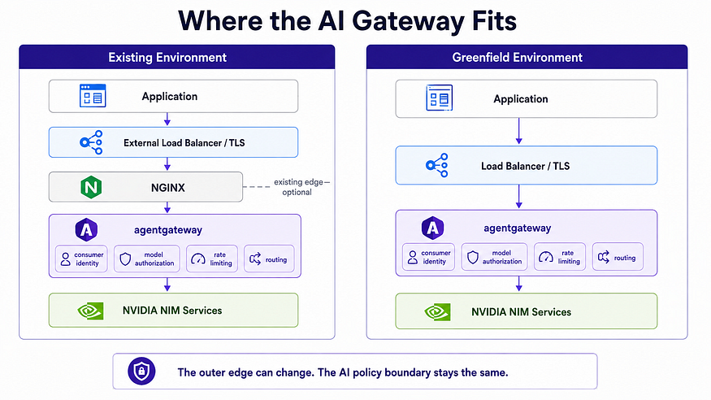

The outer edge can change without changing the AI policy boundary.

In a brownfield environment, the existing NGINX edge can remain responsible for DNS, TLS, and public routing. In a greenfield environment, agentgateway can be exposed directly through an approved Kubernetes north-south path. The key decision is that once traffic reaches agentgateway, identity, model authorization, rate limits, routing, and observability belong to the gateway layer.

### 2. Start with the model contract

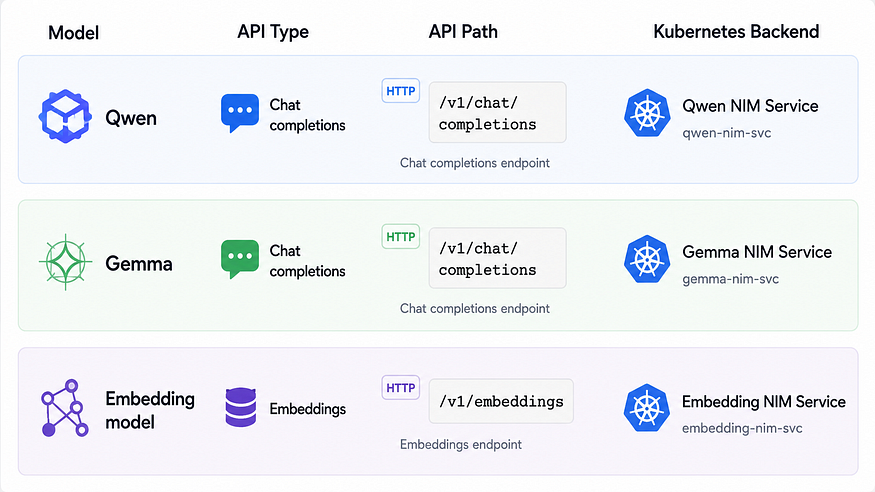

Every model needs a clear contract before it is published:

- model key;
- API type;
- request path;
- Kubernetes backend;
- consumer-facing purpose.

That contract prevents accidental publication of every endpoint a NIM Service exposes. A model may have health, metadata, metrics, or operational paths. Those paths can be useful internally, but they are not automatically part of the application-facing API.

### 3. Separate the control plane from the data plane

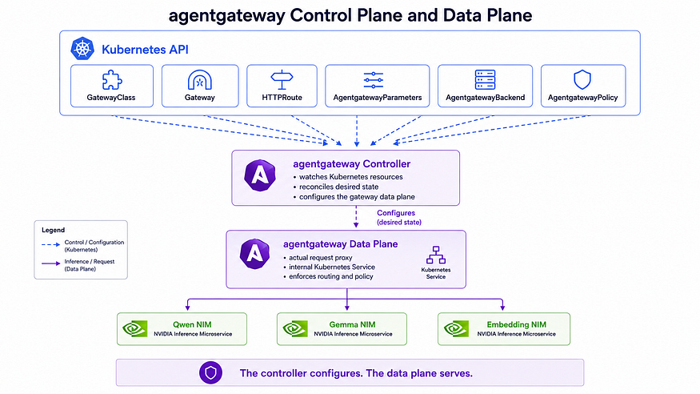

The agentgateway controller is not the gateway carrying model traffic.

The controller watches Kubernetes resources and reconciles the desired state. The generated data-plane proxy serves requests. This distinction matters during troubleshooting:

- if the Gateway is not programmed, start with the controller and the Kubernetes resources it watches;
- if the Gateway is programmed but requests fail, inspect the data plane, routes, policies, rate-limit path, or backend Services.

Generated data-plane resources are inspected, but they are never manually maintained as the source of truth.

### 4. Treat chat and embedding APIs differently

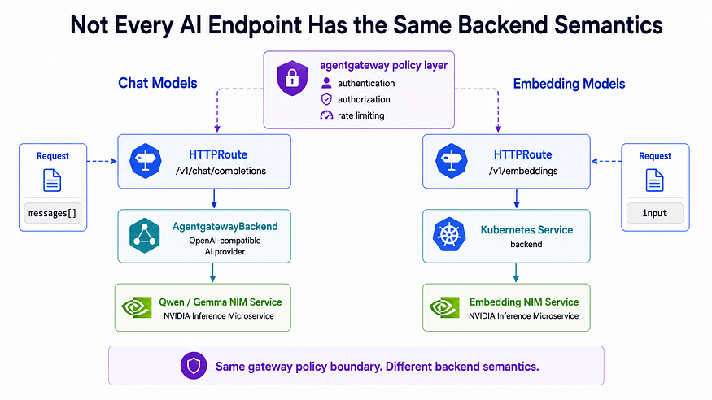

Chat completions and embeddings are both AI APIs, but they do not have the same backend semantics.

In the tested agentgateway v1.3.1 baseline:

- OpenAI-compatible chat models use AgentgatewayBackend as an AI provider backend.
- Embedding models are routed through agentgateway to the normal Kubernetes Service backend.

The embedding route still receives authentication, authorization, rate limiting, and observability. Only the final backend representation differs.

### 5. Build the air-gap dependency graph before installation

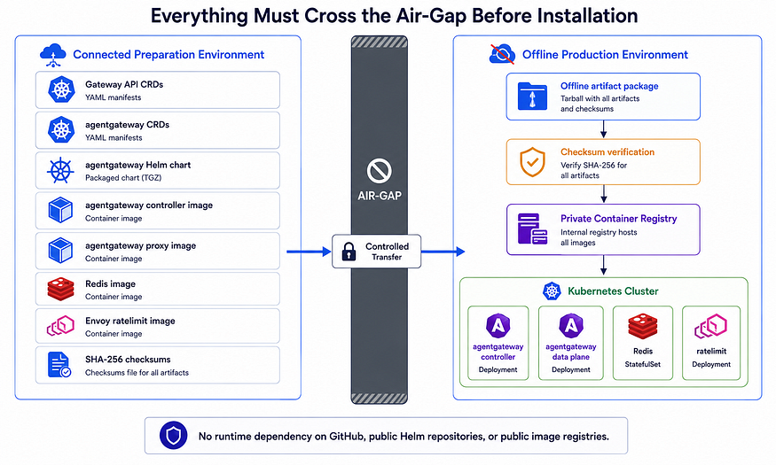

In an internet-connected cluster, a Helm install can hide many external dependencies. In an air-gapped cluster, nothing can be assumed.

The offline package is a dependency graph. It must account for Gateway API CRDs, agentgateway CRDs, controller images, proxy images, Redis, rate-limit service images, manifests, chart inputs where allowed, rendered output where needed, and checksums. The package should be verified before it crosses the boundary and again before it is used.

The production rule is simple: runtime workloads pull from the internal registry, not from the public internet.

### 6. Creating the Gateway creates the data plane

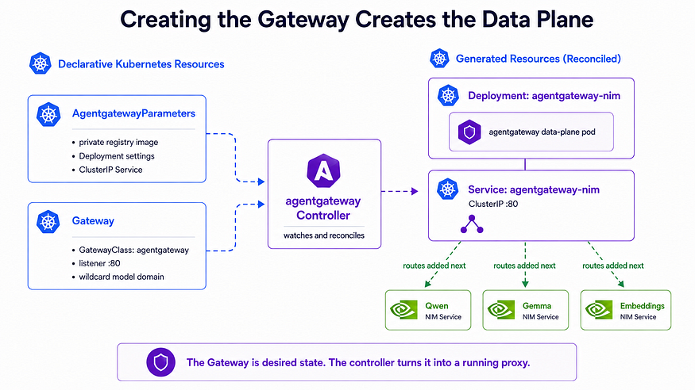

The Gateway is declarative intent. The controller turns that intent into a running proxy.

For the retained-edge pattern, the generated Service can stay internal. The public edge forwards to it only after internal tests pass. If the edge is removed in a greenfield environment, the exposure mechanism changes, but the route and policy model should not need to change.

## Repository-level source-of-truth contract

All generated runtime resources are inspected but never manually maintained as the source of truth.

That contract drives the whole repository:

- Checked-in source is the authority: documentation, future templates, future Kustomize or Helm values, and retained scripts.
- Controller-generated Deployments and Services may be inspected for health and drift, but not permanently edited with ad hoc patching.
- If a generated resource needs different behavior, the declarative input that produces it must change.
- Rendered manifests and generated run directories are operational outputs, not normal Git source.
- Air-gap payloads such as image archives, chart archives, rendered third-party CRDs, DOCX/PDF handover files, and generated handover artifacts stay outside Git.

No phase may leave `kubectl set`, `kubectl patch`, or `kubectl edit` as the source of truth.

## Retained NGINX edge versus greenfield direct exposure

The retained edge and the AI policy layer are separate decisions.

In the retained NGINX edge pattern:

```text
client
  -> existing NGINX or approved edge
  -> internal agentgateway data-plane Service
  -> selected NVIDIA NIM Kubernetes Service
```

NGINX keeps responsibility for public DNS, TLS, and existing network admission. Cutover changes the edge backend. Rollback restores the previous edge route to the original NIM Services.

In the greenfield direct exposure pattern:

```text
client
  -> approved load balancer or Kubernetes exposure path
  -> agentgateway data plane
  -> selected NVIDIA NIM Kubernetes Service
```

The Gateway and route/policy model stays the same. What changes is the surrounding exposure design: load balancer, firewall, DNS, TLS, and operational ownership.

## Gateway API routing versus agentgateway AI policy

Gateway API becomes the routing contract.

GatewayClass identifies the controller that implements the Gateway. Gateway describes the listener and route attachment rules. HTTPRoute describes host and path routing.

agentgateway adds the AI-specific layer. It owns consumer authentication, model authorization, AI backend behavior, rate-limit policy, and AI observability attributes.

That split is the point of the design. HTTP routing remains visible as Kubernetes networking, while model policy does not get buried inside a generic reverse-proxy configuration.

## One Gateway, separate model routes

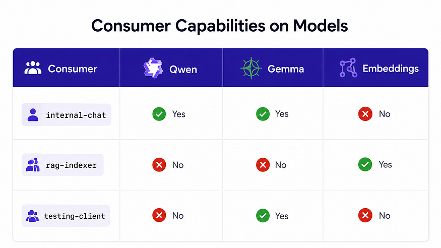

The baseline uses one Gateway for the AI platform and one HTTPRoute per model-facing API.

This gives a direct relationship between a model and the policy required to use it. If an application can call one model but receives 403 on another, there is one route and one policy boundary to inspect.

The first implementation keeps Gateway, model routes, and model backend references in one namespace. If model teams later own separate namespaces, ReferenceGrant and namespace ownership become part of the trust model. Cross-namespace routing must be explicit.

## Application identity versus human identity

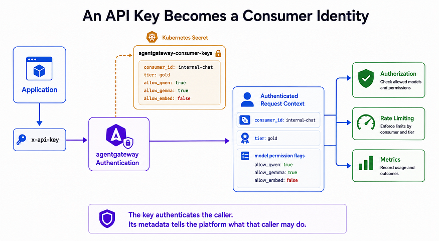

The baseline identity is application identity.

One stable consumer record belongs to one workload or application. That identity can carry metadata such as consumer name, team, environment, model permissions, and rate-limit tier.

Human identity is a different problem. A browser user may authenticate to an application backend, but the gateway should not receive a long-lived model key directly from browser JavaScript. The backend owns the user session and calls the gateway with its application credential unless a future user-delegation design is explicitly added and tested.

## Authentication, authorization, rate limiting, and observability

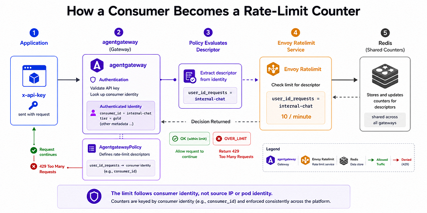

Authentication answers: do I know this caller?

Authorization answers: is this known caller allowed to use this route?

Rate limiting answers: how much of the allowed capability has this caller already consumed?

Observability answers: which application identity, model, route, status, and policy path produced this request?

These controls belong at the gateway layer so that each NIM deployment does not need to reimplement them.

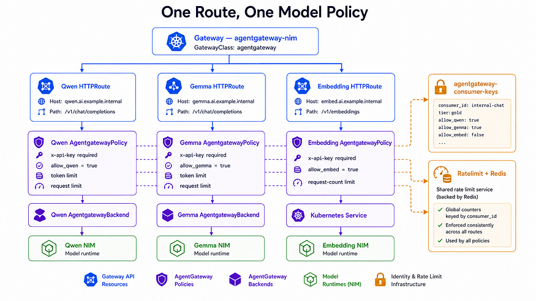

Consumer identity should remain a bounded metric dimension. It should identify stable workloads, not arbitrary people or prompt text.

## Prove the policy path before changing production traffic


The gateway path should be tested internally before the public edge changes.

That means proving the generated data plane, Host header behavior, route matching, authentication, authorization, model routing, and rate limits without DNS, TLS, external load balancers, or legacy ingress behavior in the way.


The required tests are not only successful requests. The platform must also prove expected failures:

- no key should fail with 401;
- unknown key should fail with 401;
- known consumer without model permission should fail with 403;
- unknown host or path should fail as routing, not identity;
- rate-limit exhaustion should return 429;
- authorized model requests should return success from the intended backend.

## Keep cutover smaller than deployment

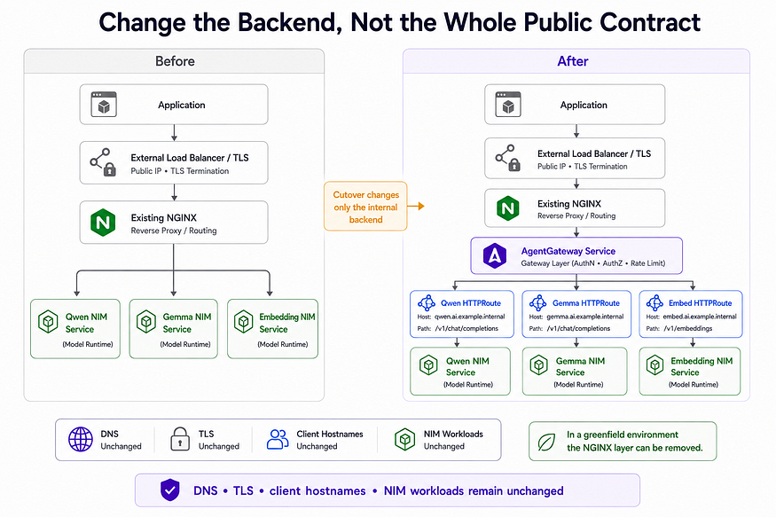

Cutover should be smaller than installation.

If the gateway is installed and internally verified, the production change is the edge path. In a retained-edge environment, DNS and TLS do not need to move. The existing hosts point to the gateway instead of directly to NIM Services.

If public traffic fails after cutover, the first rollback action is not to uninstall the gateway. The first action is to restore the previous edge backend so the known working application path returns quickly.

## Gateway lifecycle versus NVIDIA NIM lifecycle

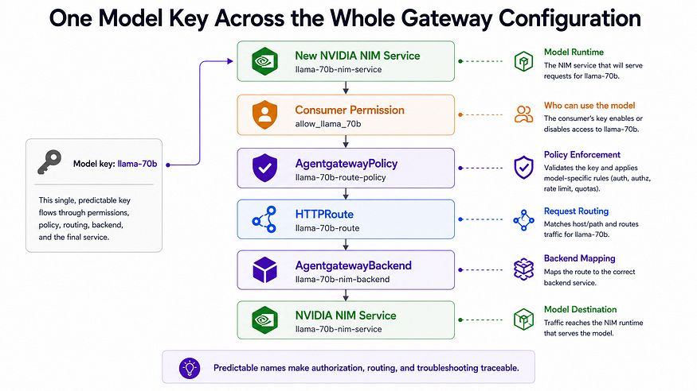

The gateway lifecycle and the NIM lifecycle are separate.

Gateway lifecycle includes Gateway API CRDs, agentgateway CRDs, controller, generated data plane, routes, policies, consumer metadata, rate limits, observability, cutover, rollback, and cleanup.

NIM lifecycle includes model image choice, GPU scheduling, serving runtime, model readiness, endpoint behavior, scaling, and model decommissioning.

The gateway should verify that a NIM Service is healthy before publishing it. It should not hide a broken model behind a new policy layer.

## New models start denied

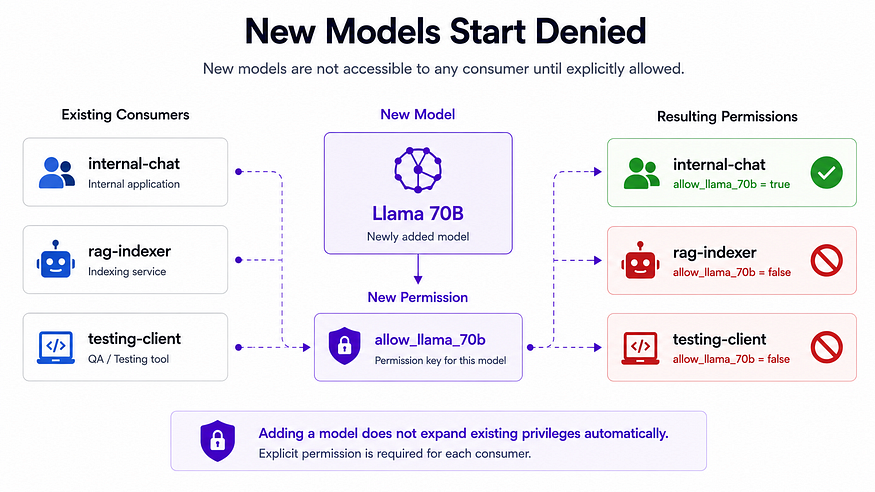

Adding a model must not increase anyone's permissions by accident.

The safe default is:

1. verify the NIM Service works;
2. create the model route and backend representation;
3. keep existing consumers denied;
4. explicitly grant selected consumers;
5. add rate-limit entries deliberately;
6. test allowed, denied, unknown, and rate-limited paths.

This keeps model onboarding as a normal platform operation instead of a one-off production change.

## API keys have a lifecycle

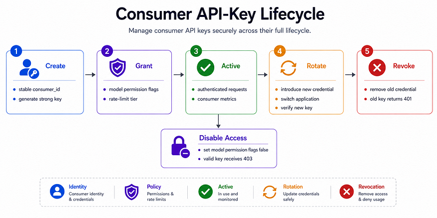

Disabling a consumer is different from revoking a key.

Disabling access preserves the consumer record and audit meaning while removing model permissions. Revoking removes or invalidates the credential material. Rotation should support overlap: add the new credential, move the application, verify traffic, then remove the old credential.

Long-lived API keys do not belong in public frontend JavaScript. A browser should call an application backend. The backend should hold the application credential through an approved runtime secret path.

## Troubleshooting starts from the response code

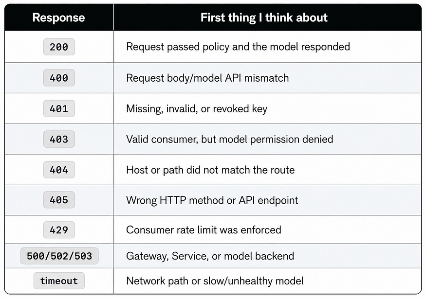

The response code narrows the first investigation step:

- 401 starts with identity;
- 403 starts with entitlement;
- 404 starts with host, path, and route matching;
- 405 starts with method or endpoint shape;
- 429 starts with rate-limit descriptors and counters;
- 500, 502, and 503 start with gateway, Service, or model backend health.

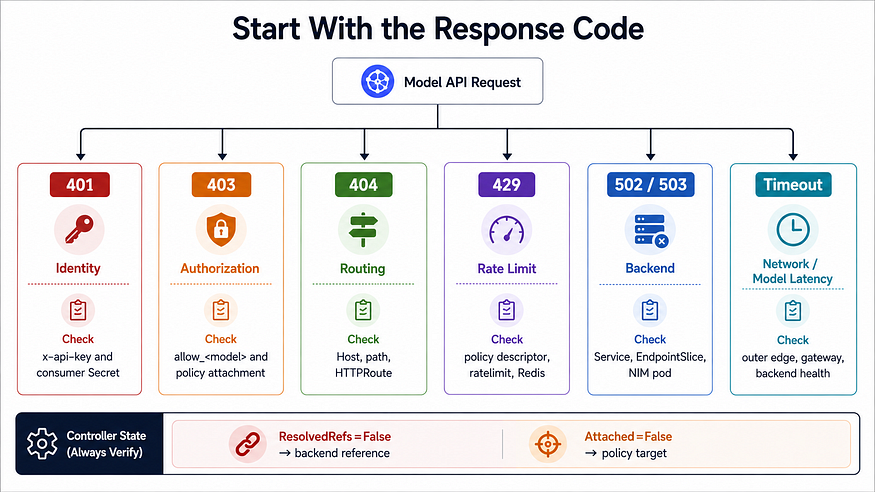

Rate-limit failures should be inspected in order: route match, policy target, descriptor shape, rate-limit service, Redis state, and then client retry behavior.

## Decommissioning starts with traffic dependency

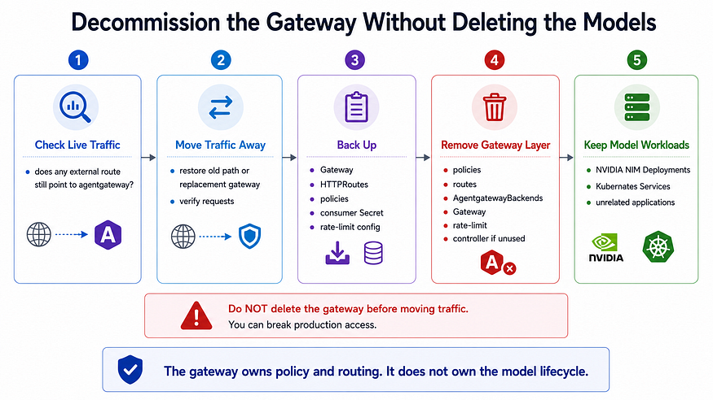

Decommissioning the gateway should not start by deleting resources.

First check whether live traffic still depends on the gateway. Then move traffic away, back up policy and consumer state, remove gateway-layer resources, and keep NIM workloads unless the model lifecycle separately requires removal.

The gateway owns policy and routing. It does not own the model lifecycle.

## Final architecture

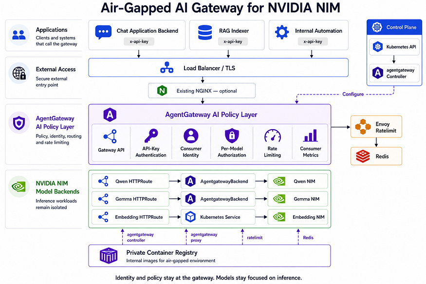

At the end, the platform has a clear shape:

- applications call a stable AI gateway path;
- the edge may be retained NGINX or a greenfield exposure path;
- Gateway API expresses listener and HTTP routing intent;
- agentgateway enforces AI-specific policy;
- the controller reconciles;
- the generated data plane serves;
- Redis and the rate-limit service hold quota state;
- NIM Services stay focused on inference;
- private registry artifacts keep the runtime air-gapped;
- operational changes remain declarative and rollback-aware.

That is the contract this repository should preserve as implementation phases are added.
