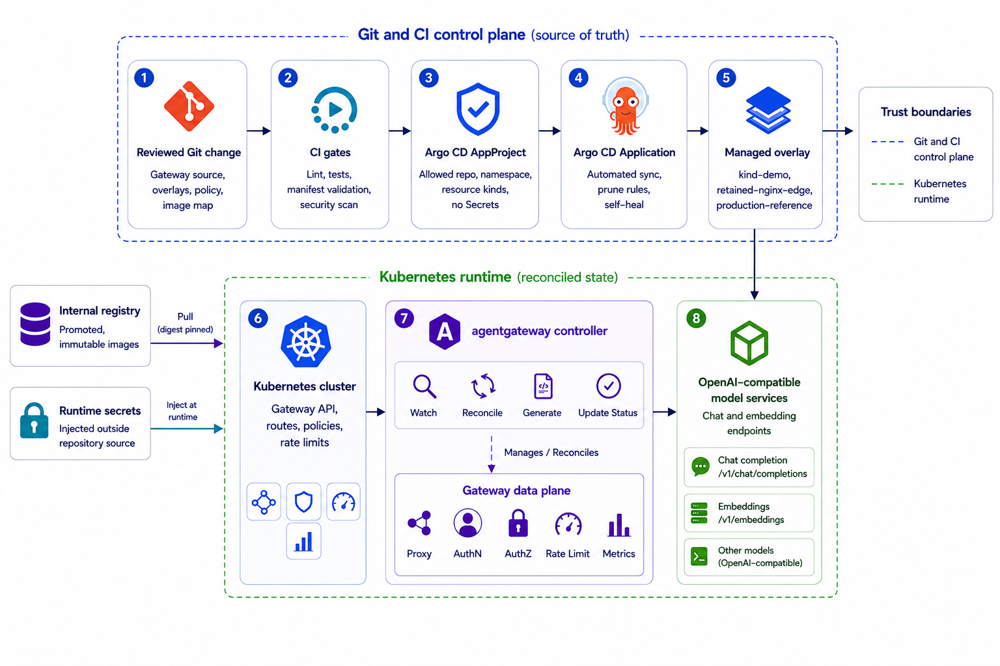

# Argo CD GitOps Deployment

Argo CD gives this platform a continuous reconciliation path. The operator still
builds the air-gap bundle, promotes images into the internal registry, validates
the manifests, and proves the request path. Argo CD then watches the approved
Git source and keeps the selected overlay in sync.

The important boundary is simple: Argo CD owns the declared gateway source, not
the model runtime lifecycle and not runtime secret values.



## Operating model

The GitOps phase has three layers:

| Layer | What it contains | Owner |
| --- | --- | --- |
| Argo CD project | Repository allowlist, destination namespace, and permitted resource kinds | Platform team |
| Argo CD application | The selected environment path, automated sync policy, and reconciliation options | Platform team |
| Managed overlay | The Kustomize overlay Argo CD applies to the cluster | Repository source |

Argo CD is treated as an existing platform service. This repository does not
install Argo CD itself, and it does not add Argo CD controller images to the
gateway compatibility lock. Environments that need Argo CD installed offline
should manage that as part of their cluster platform baseline.

## Source layout

```text
gitops/argocd/
├── applications/              # One Argo CD Application per gateway profile
├── bootstrap/                 # Kustomize entrypoints applied to the argocd namespace
├── managed-overlays/          # Argo CD-facing wrappers around the gateway overlays
└── projects/                  # AppProject with source, destination, and kind limits
```

The managed overlays wrap the normal platform overlays. They do not fork the
gateway manifests. Their job is to add GitOps-specific metadata, including prune
protection for model Service contracts, while preserving the tested platform
source.

## Environments

| Environment | Argo CD application | Managed overlay |
| --- | --- | --- |
| `kind-demo` | `ai-gateway-kind-demo` | `gitops/argocd/managed-overlays/kind-demo` |
| `retained-nginx-edge` | `ai-gateway-retained-nginx-edge` | `gitops/argocd/managed-overlays/retained-nginx-edge` |
| `production-reference` | `ai-gateway-production-reference` | `gitops/argocd/managed-overlays/production-reference` |

Every Application points at the `main` branch of the public project repository:

```text
https://github.com/ahmed658/airgap-ai-gateway-platform.git
```

In a disconnected environment, mirror that repository into the internal Git
service and replace the `repoURL` through the same reviewed source process used
for any other environment-specific change.

## Reconciliation policy

All three Applications use automated reconciliation:

- `prune: true`
- `selfHeal: true`
- `allowEmpty: false`
- server-side apply
- prune last
- fail on shared resources
- apply only out-of-sync resources

That posture moves the approval point. With automated sync there is no second
confirmation at deploy time: the merge to the watched branch *is* the production
approval, and Argo CD converges the cluster to Git without asking again. Branch
protection and CI gates are therefore load-bearing rather than advisory. An
environment that cannot enforce them should run the direct CLI path instead,
where the apply gate provides the second checkpoint.

## Guardrails

The AppProject restricts Argo CD to:

- the project repository;
- the `ai-gateway` namespace;
- the Kubernetes resource kinds this platform owns;
- the agentgateway and Gateway API kinds used by the baseline.

It does not whitelist `Secret` resources. Runtime credentials remain in the
environment secret workflow. The repository declares names, labels, and metadata
contracts; it does not carry key material.

The managed overlays add `Prune=false` to the three model Service contracts.
Those Services are the stable gateway-facing contracts to the model runtime.
Argo CD can reconcile their desired shape, but automated pruning should not
delete them as a side effect of an Application lifecycle event.

## Validate before bootstrapping

Run the normal platform checks first:

```bash
make lint
make test
make validate
make gitops-validate
```

Render one GitOps environment when you want to review exactly what Argo CD will
receive:

```bash
make gitops-render GITOPS_ENV=production-reference
```

Or call the CLI directly:

```bash
airgap-ai-gateway --config examples/config gitops render \
  --environment production-reference \
  --output-dir build/gitops/production-reference

airgap-ai-gateway --config examples/config gitops validate
```

Validation checks the Argo CD project boundary, Application source path,
automated sync settings, managed overlay semantics, private-registry image
references, route protection, and the absence of rendered Secrets.

## Bootstrap the Application

The bootstrap step applies only two Argo CD resources: the AppProject and the
selected Application. It does not directly deploy the gateway objects; Argo CD
does that after it observes the Application.

Plan first:

```bash
airgap-ai-gateway --config examples/config gitops plan \
  --environment production-reference \
  --apply-mode server-side-dry-run \
  --output-dir runs/plans/gitops-production
```

Capture the current Argo CD resource state:

```bash
airgap-ai-gateway snapshot create \
  --plan-file runs/plans/gitops-production/plan.json \
  --expected-context kind-airgap-ai-gateway \
  --output-file runs/snapshots/gitops-production-pre-change.json
```

Apply the reviewed plan:

```bash
airgap-ai-gateway --config examples/config gitops apply \
  --expected-context kind-airgap-ai-gateway \
  --apply-mode server-side-dry-run \
  --confirm I_UNDERSTAND_DISPOSABLE_CONTEXT_ONLY \
  --plan-file runs/plans/gitops-production/plan.json \
  --snapshot-file runs/snapshots/gitops-production-pre-change.json \
  --commands-log runs/reports/gitops-production/commands.log
```

Use `live` only when the same plan, rendered source, and environment checks have
been reviewed.

## Prove the reconciliation

After Argo CD reports the Application as synced and healthy, run the platform
verification. The gateway has to prove the same behavior whether it was applied
directly or reconciled by GitOps:

```bash
airgap-ai-gateway --config examples/config verify runtime \
  --expected-context kind-airgap-ai-gateway \
  --gateway-url https://gateway.example.internal \
  --credential internal-chat=example-only-do-not-use \
  --credential rag-indexer=example-only-do-not-use \
  --credential testing-client=example-only-do-not-use
```

For local source validation without a cluster:

```bash
make gitops-kind-smoke
```

That target creates a server-side-dry-run plan for the `kind-demo` Application
bootstrap. The check is static by design; the full behavioural cluster proof
remains `make kind-test`.

## Rollback with GitOps

The preferred GitOps rollback is a Git revert followed by Argo CD reconciliation.
The cluster should move back because the watched source moved back.

When the Argo CD bootstrap itself has to be rolled back, use the saved snapshot
and state ledger from `gitops apply`, the same way the direct deployment path
does. Do not delete model Services or runtime credentials as part of a gateway
rollback. Model runtime lifecycle remains separate from gateway lifecycle.

## Upgrade track

The GitOps layer tracks the same compatibility contract as the rest of the
repository:

- `baseline-v1.3.1` is the delivered path.
- agentgateway v1.4.0 remains a validation target.
- Gateway API changes are not folded into this GitOps path until the manifests,
  policy behavior, rollback behavior, and documentation all pass tests.
