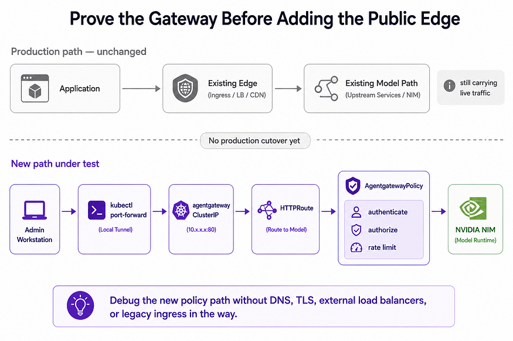
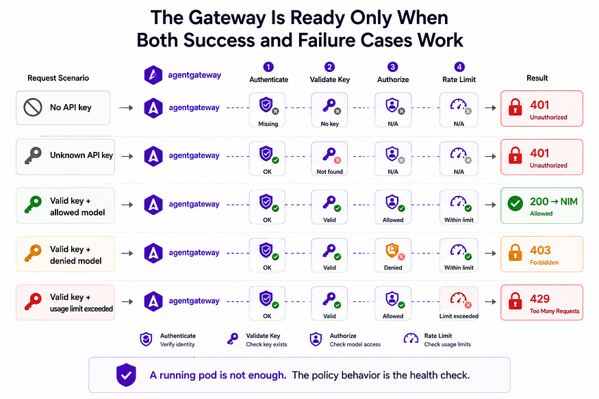

# Disposable Kind End-to-End Lab



The kind lab is the local proof path for the gateway contract. It creates a
unique cluster, a unique local registry, repository-owned mock model backends,
runtime-only fake credentials, and evidence files for review.

The lab does not require NVIDIA GPUs, model weights, or real NIM images. The
three backend Services are served by a small OpenAI-compatible mock image:

- Qwen chat mock.
- Gemma chat mock.
- Embedding mock with a deterministic non-empty vector.

## What the lab proves



The lab runs the expected gateway matrix:

- Missing key returns 401.
- Unknown key returns 401.
- Allowed Qwen consumer returns 200.
- Denied Qwen consumer returns 403.
- Allowed Gemma consumer returns 200.
- Allowed embedding consumer returns 200 with vector length greater than zero.
- Denied embedding consumer returns 403.
- Low-limit repeated traffic reaches 429.
- Wrong Host returns 404.
- Broken backend produces route diagnostics or an expected upstream failure.
- Runtime image references use the local registry.
- Model Services survive gateway cleanup.

## Run it

The full lab command is:

```bash
make kind-test
```

Optional retained-edge validation:

```bash
python scripts/kind_e2e_lab.py run --with-nginx
```

The command creates, tests, reports, and removes the lab. Evidence is written
under `runs/kind-e2e-*/evidence/`, which is outside version control.

## Safety boundary

The lab only accepts cluster names that start with `agw-e2e-`. Every kubectl
operation verifies the exact generated kind context before it runs. Teardown
uses the generated cluster name and refuses unrelated names.

Runtime credentials are fake and are generated under the run directory. They are
not stored in repository source.

## Air-gap simulation gate

The connected preparation phase builds or promotes every runtime image into the
unique local registry. After that point, the lab validates rendered manifests and
runtime Pod image references. Any public registry reference fails the run.

The supported multi-node pattern is a registry reachable by all nodes. The lab
does not rely on loading an image into only one node as the proof strategy.
